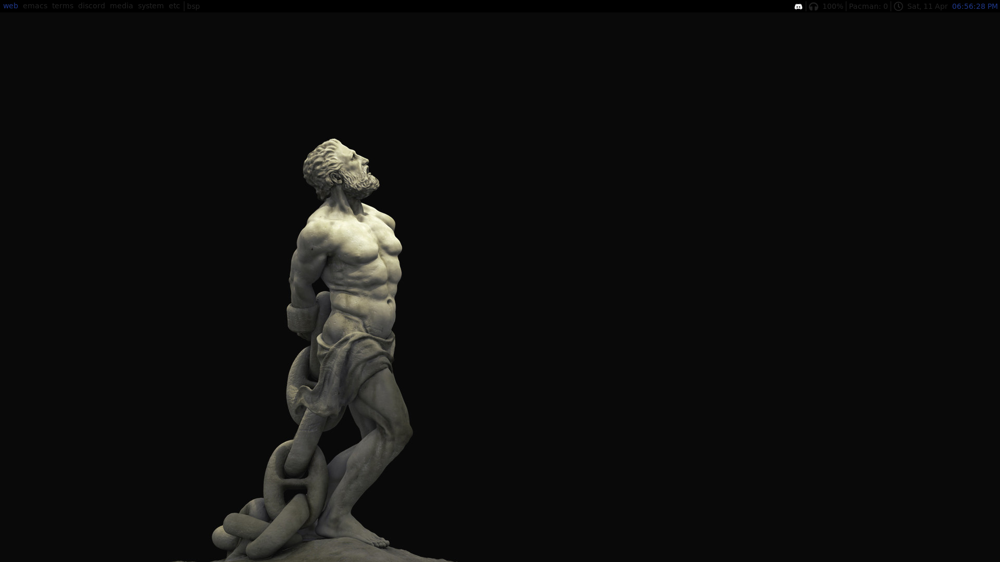

# qtile configs

these are not part of my dotfiles because I don't use qtile anymore but * belongs to `~/.config/qtile/`

`icons` dir is only used in `experiment.py`

`schemer.py` is only used in `config.py` (it was supposed to be a little script to easily change color scheme from outside the config file but I never wrote it so it's just a python dictionary now from where 4 colors are imported to `config.py`)

## `config.py` the one I was using

## `experiment.py` old conf from when I was just experimenting with qtile

